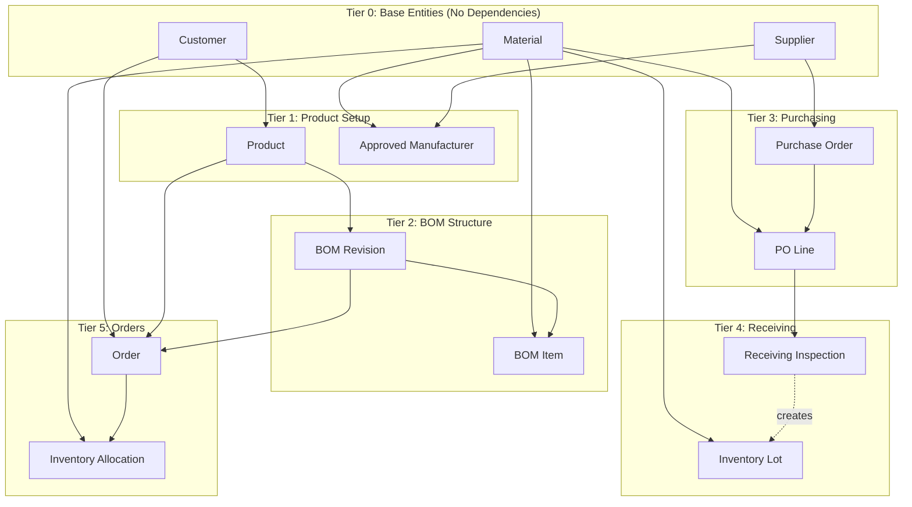
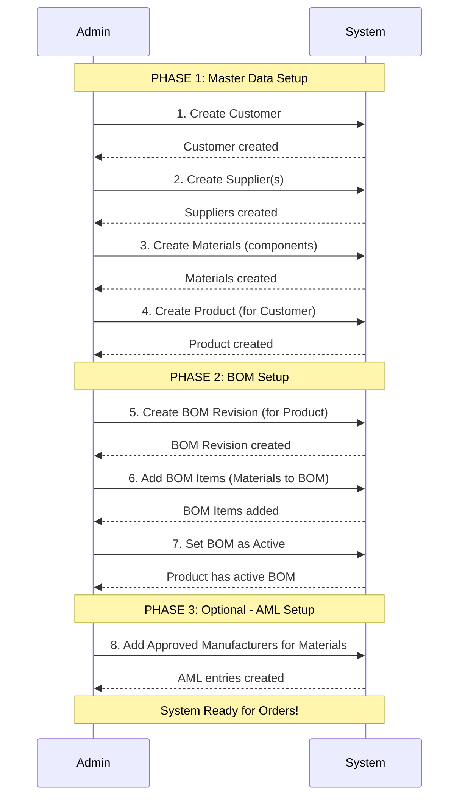
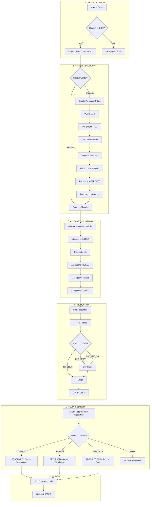
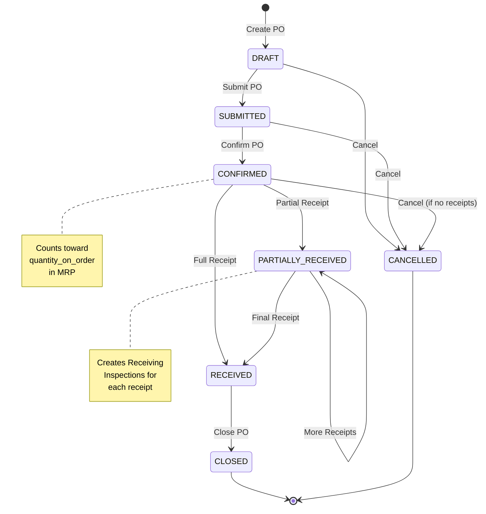
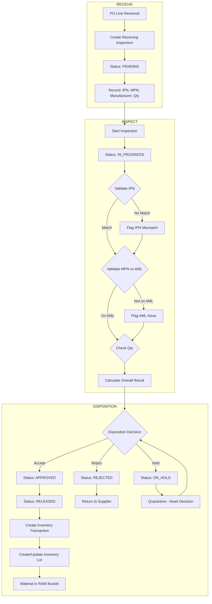
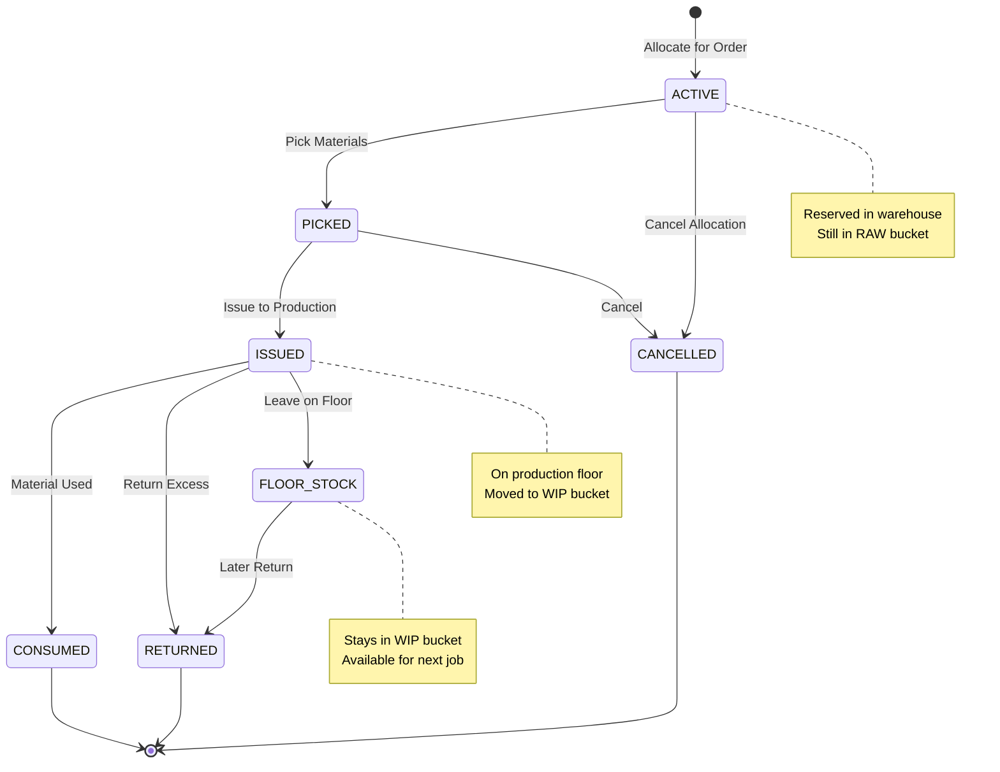
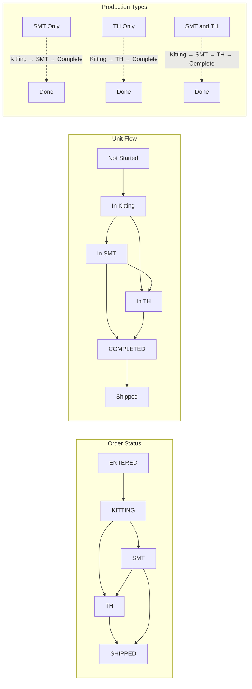
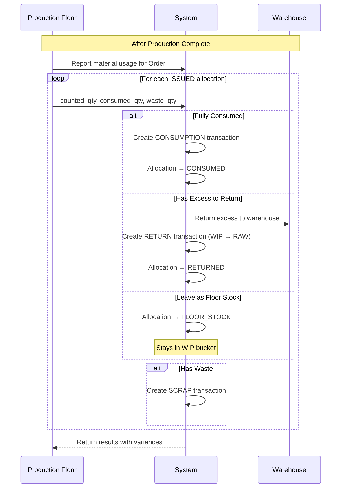
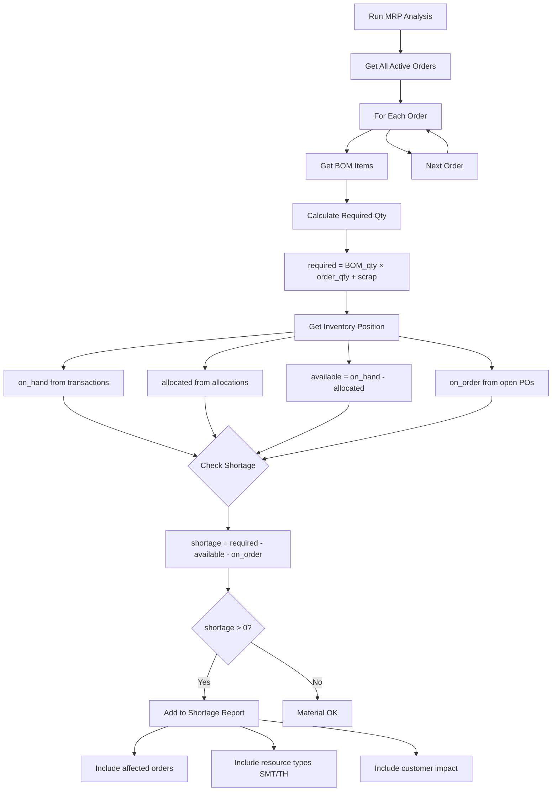
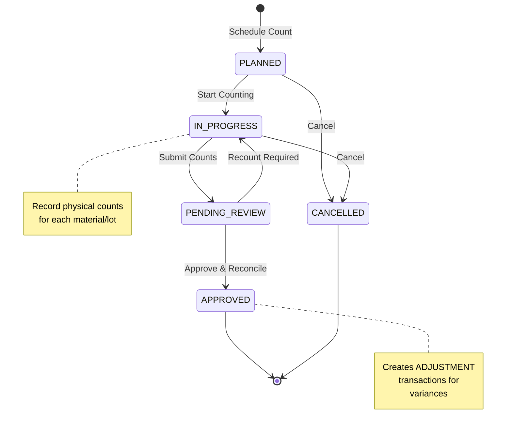

# ERP System Workflows

## 1. Entity Creation Dependencies

This diagram shows what must be created before other entities can be created.

## 2. Complete System Setup Sequence

This shows the order in which you must set up the system before creating orders.

## 3. Complete Order-to-Shipment Workflow

## 4. Purchase Order Workflow

## 5. Receiving & Inspection Workflow

## 6. Inventory Allocation Lifecycle

## 7. Production Stage Flow

## 8. Material Return from Production

## 9. MRP Shortage Analysis

## 10. Cycle Count Workflow

## Quick Reference: What to Create First

| To Create This... | You Need These First |
|-------------------|---------------------|
| Product | Customer |
| BOM Revision | Product |
| BOM Item | BOM Revision + Material |
| Purchase Order | Supplier |
| PO Line | Purchase Order + Material |
| Order | Customer + Product + Active BOM |
| Allocation | Order + Material (with inventory) |
| Approved Manufacturer | Material + (optionally) Supplier |

## Quick Reference: Status Flows

| Entity | Status Flow |
|--------|-------------|
| **Order** | ENTERED → KITTING → SMT → TH → SHIPPED (or ON_HOLD/CANCELLED) |
| **Purchase Order** | DRAFT → SUBMITTED → CONFIRMED → PARTIALLY_RECEIVED → RECEIVED → CLOSED |
| **Receiving Inspection** | PENDING → IN_PROGRESS → APPROVED/REJECTED/ON_HOLD → RELEASED |
| **Allocation** | ACTIVE → PICKED → ISSUED → CONSUMED/RETURNED/FLOOR_STOCK |
| **Cycle Count** | PLANNED → IN_PROGRESS → PENDING_REVIEW → APPROVED |
